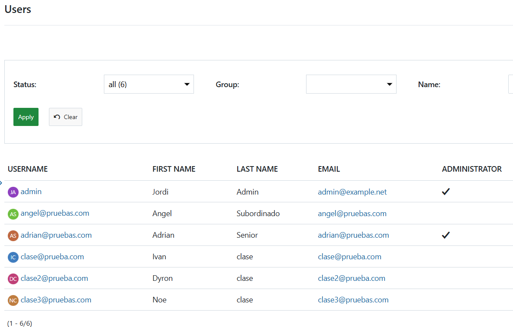
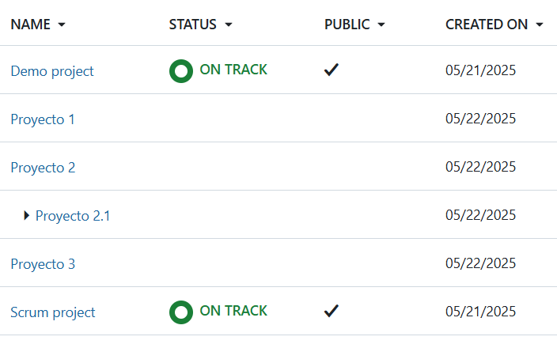

# Documentación Jordi Patuel Pons. Prácticas AUTIS. Proyecto OpenProject.
## Paso 1. Documentación inicial sobre OpenProject.
### 1.1 Parte básica.
#### 1.1.1 Para qué sirve OpenProject.
OpenProject es un software de código abierto que sirve para gestionar proyectos, de tal manera que se espera una mayor agilidad y eficiencia. Ejemplos de las acciones para las que sirve Openproject podrian ser:
- Asignar de manera eficiente tareas
- Visualizar tareas asignadas.
- Organizar calendarios, con diagramas de Gannt, para una mejor gestión de los tiempos.
- Tableros de organización de equipos y proyectos.(Metodologias Scrum, Agile, Kanban).
- Informes de tiempo.
- Costes laborales.
Y muchas otras funciones que se pueden ver más especificadas en la web  [OpenProject](https://www.openproject.org/es/funcionalidades-software-colaboracion/)

> Es un software comparable a Jira o Trello. Dos herramientas que hemos estudiado en el ciclo.

#### 1.1.2 Funcionamiento general de la plataforma.

Como se explcia en el punto anterior, desde OpenProject se pueden gestionar proyectos, una vez creas un proyecto nuevo, asignas a las personas de tu equipo que vais a trabajar en este proyecto. A su vez, generaras las tareas, los tiempos de entrega de estas tareas para poder llevar un seguimiento, podras asignar tareas a cada uno de tus miembros de equipo, los cuales tendran diferentes roles según necesites. Podras añadir los documentos que necesites para tu equipo.  
Tambien podras clasificar las tareas por categorias que necesites, ya sea una pioridad, un estado o un departamento al que pertenecen.

#### 1.1.3 Acceso al entorno gráfico en la plataforma web.
Para acceder al entorno grafico se utiliza el *http://localhost:8080*, que es el puerto en el que se ha desplegado la herramienta en tu servidor local. Deberas iniciar sesión por primera vez con el usuario: admin y la contraseña: admin. Una vez dentro te pedira que cambies la contraseña. 

En el lateral izquierdo estará un desplegable donde podras acceder tus proyectos, actividad, diagramas de Gannt, reuniones, tiempos y costes, etc. En la parte superior un buscador, el acceso a la cuenta, acceso rapido a los apartados del menu de la izquierda. 

La pagina inicial al abrir OpenProject te indica para crear un nuevo proyecto, invitar usuarios, novedades de la herramienta y novedades de tus acciones dentro de la herramienta.

### 1.2 Parte técnica.
#### 1.2.1 Funcionamiento de la API REST.
Segun [IMB](https://www.ibm.com/es-es/think/topics/rest-apis),  una API REST es un estilo o estándar que permite la comunicación entre una app o web y un servidor, mediante el protocolo HTTP. 
Las posibles acciones se resumen en las operaciones CRUD(*Create, Read, Update, Delete*) que se traducen a los metodos que se utilizan como,**POST, GET, PUT, DELETE**. 

La estructura es en base a rutas, por ejemplo heladeria/sabor/1. Con los metodos anterior mente mencionados se podria editar, crear etc. sobre esta ruta. 

Los datos que se intercambian son en formato JSON la mayoria. El modelo de API REST sigue el principio de statless, es decir no tiene estado, el servidor necesitará que en la solicitud este toda la información necesaria. 

#### 1.2.2 Formato y estructura de la BBDD.
Si accedemos a la base de datos de pgAdmin podremos ver la estructura de la base de datos.

Por lo que podemos ver, bastante extensa. Dentro de Schemas, podremos ver las tablas de la base de datos, hay 161 tablas. Aqui podremos ver tablas como las de users o projects  y como estan formadas. Se puede ver los valores que puede contener. 

Como se observa en las imagenes, la estructura de la BBDD es grande, deberiamos darle un vistazo en profundidad para comprender su estructura y asi poder ejecutar consultas de sql, porque como hemos comentado en la primera reunion, algunas veces conviene más poder hacer las consultas directamente a la BBDD que con la API.

#### 1.2.3 Motor de BBDD utilizado (por defecto: PostgreSQL).
Segun [PostgreSQL](https://www.postgresql.org/about/), PostgresSQL es de codigo abierto, es un sistema de base de datos relacional que utiliza y amplía el lenguaje de SQL. Tiene buena reputacion por su arquitectura fiable, robustez en sus funciones, extensibilidad(*puede definir sus propios tipos de datos, crear funciones personalizadas e incluso escribir código desde diferentes lenguajes de programación*) y por su comunidad de codigo abierto que la respalda.   

#### 1.2.4 Cómo desplegar OpenProject en local con Docker.
Segun la documentacion de [OpenProject](https://www.openproject.org/es/docs/installation-and-operations/installation/docker/) podemos desolegar nuestro propio OpenProject de manera sencilla con el comando :
>docker run -it -p 8080:80 \
  -e OPENPROJECT_SECRET_KEY_BASE=secret \
  -e OPENPROJECT_HOST__NAME=localhost:8080 \
  -e OPENPROJECT_HTTPS=false \
  -e OPENPROJECT_DEFAULT__LANGUAGE=en \
  openproject/openproject:15

La primera vez que se ejecute el comando tardará un poco. Una vez terminado el despliegue, podremos acceder con las creedenciales por defecto, usuario admin y contraseña admin. 
Tambien se podria desplegar buscando en docker el proyecto de openproject.

## Paso 2. Despliegue local de OpenProject.
Para este paso, se ha instalado docker. Primero probamos a buscar el OpenProject desde el buscador de Docker, he intentamos desplegar desde ahi, tras pelear un poco vimos que no sabiamos que era el fallo. Decidimos copiar el comando para inicializar el OpenProject que hay en los pasos para instalar desde la web de Openproject.

> docker run -d -p 8080:80 -e OPENPROJECT_SECRET_KEY_BASE=secret -e OPENPROJECT_HOST__NAME=localhost:8080 -e OPENPROJECT_HTTPS=false openproject/openproject:15

Como tiene saltos de linea lo modificamos para que ejecutase todo en un solo comando. Aunque el proyecto final que abrimos lo volvimos a lanzar con el comando modificado. Lo tuvimos que modificar para poder conectar el puerto a pgAdmin.

> docker run -d -p 8080:80 **-p 8081:5432** -e OPENPROJECT_SECRET_KEY_BASE=secret -e OPENPROJECT_HOST__NAME=localhost:8080 -e OPENPROJECT_HTTPS=false openproject/openproject:15

La modificacion ha sido añadir **-p 8081:5432** . Segun explicaciones de nuestro compañero Adrian que tiene más conocimientos, lo que necesitabamos era hacer visible el puerto 5432. Así conseguimos conectar pgAdmin a la base de datos del proyecto creado y de esta forma ver las tablas y poder ejecutar las consultas. 

Lo que he entendido es que con el comando estamos exponiendo el puerto de la base de datos para que sea accesible, es decir, accedemos desde nuestro puerto 8081 al puerto de la base de datos 5432. En resumen, hacerlo visible porque esta dentro del contenedor y no se puede acceder(o es más facil de esta manera).

## Paso 3. Introducción de datos.

He intorducido datos aleatorios, en el entorno grafico de OpenProject. Para añadir proyectos desde la pagina de inicio con el boton de +Project. Los usuarios los he añadido desde el apartado de Administrador, y dentro de este, Usuarios y permisos. He creado grupos desde dentro de este apartado y despues he añadido los miembros a algun proyecto. 
> Añado alguna foto de los datos introducidos.

## Paso 4. Práctica con peticiones.
Esta parte estará detallada en un documento a parte. [Ejercicios.pdf](Ejercicios.pdf)

## Paso 5. Repositorio en GitHub.
## Paso 6. Desarrollo de la página web.
