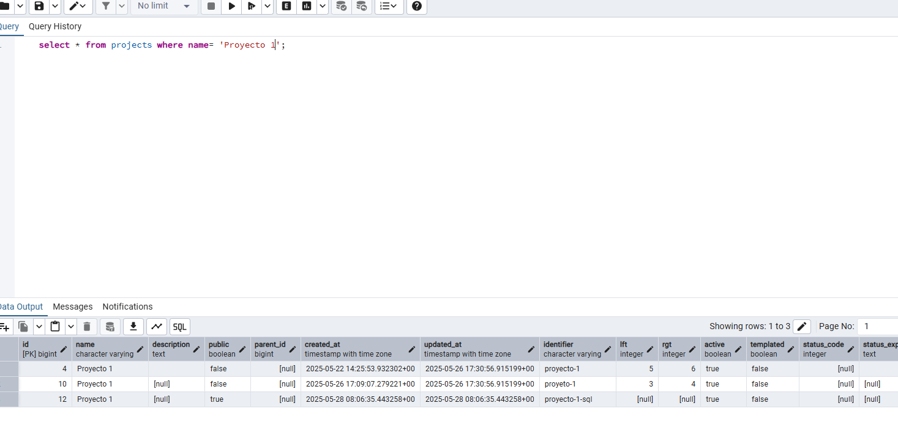

# Ejercicios prácticos con API 
## API 
Se han creado las peteciones en la apliacion de postman, con ayuda de la informacion de la [API](https://www.openproject.org/es/docs/api/endpoints/) de openproject, donde especifica que se debe poner para recibir las peteciones que queremos.  
He añadido la API key generada en la parte de authorization, el type es el BAsic auth, aqui en username Apikey y en Password la API key generada en nuestro OpenProject.

## PARTE 1 - CRUD basico de proyectos. 
### 1.1 Lista todos los proyectos.
Con "GET" y la ruta indicada en la api, hemos hecho la peticion, como resultado nos ha dado un JSON con todos los proyectos de nuestro OpenProject.

### 1.2 Crea un proyecto llamado “Proyecto de Prueba”. 
Para este ejemplo utilizo el metodo POST, y en el body le indicaremos en formato JSON "name":"Proyecto de prueba" para crear un nuevo proyecto. Podriamos utilizar todo el formato completo que nos da en la API.

### 1.3 Obtén los detalles del proyecto que acabas de crear. 
Con el metodo GET y la misma ruta pero añadiendo /8 que es el id del proyecto, obtendremos en formato JSON la información del proyecto. En la captura se ve el body, pero es de la consulta anterior.

### 1.4 Cambia el nombre del proyecto creado en el punto anterior a “Proyecto Editado”. 
Para editar utilizaremos el metodo PATCH, y como hemos hecho al crearlo, solo editando el nombre, cambiaremos el nombre al proyecto. 
Como podemos ver en la imagen, el identifier, continua siendo proyectodeprueba, ya que al crearlo se puso este automaticamente, y al editarlo no estamos editando este campo. 

### 1.5 Elimina el proyecto creado. 
Para eliminar he utilizado el metodo DELETE. como ruta pondremos el id del proyecto a eliminar. En el status podemos ver 204 . Segun la api al devolvernos esta respuesta : Devuelto si el proyecto se eliminó con éxito.

Como podemos ver el proyecto ya no existe. 

### EXTRA - Lista todos los usuarios de Open Project 
Con "GET" y la ruta indicada en la api, hemos hecho la peticion, como resultado nos ha dado un JSON con todos los usuarios de nuestro OpenProject.

 
## PARTE 2 - Consultas Ordenadas 
### 2.1 Lista los proyectos ordenados por fecha de creación (de viejo a nuevo) 
Para esta consulta se ha utilizado el GET, como queremos que esten ordenados, hemos indicado el sortBy, donde los parametros de dentro son el campo que queremos que aplique, en este caso, el orden. Esto se puede hacer directamente en la url que se lo agrega al GET o añadiendo en Params los parametros.

### 2.2 Lista los proyectos ordenados por fecha de edición (de nuevo a viejo) 
He intentado hacerlo con el filtro updetedAt, pero no me deja. La otra forma que he econtrado es con el lastest_activity_at.

### 2.3 Lista los proyectos ordenados por orden alfabético 
Para esta peticion, cambiaremos el createdAt por el name ya que nos interesa el nombre para poder ordenarlo alfabeticamente. Demo project es el primero, ya que los demas empizan como Proyecto XXXX que irian despues.

## PARTE 3 – Consultas con Filtros 
### 3.1 Crea un proyecto llamado “Proyecto 1”. 
He creado el proyecto con el metodo POST.

### 3.2 Lista todos los proyectos llamados “Proyecto 1”. 
Para esta practica, he buscado como funcionan los filtros, tras una breve pelea, he visto como funciona.

Se añadiria en los parametros como:
 - Key: filters
 - Value: iriamos cambiando los parametros,el filtro seria name, ya que queremos saber por nombre, el operador, en este caso igual a, y el valor seria "Proyecto 1".
 
 
### 3.3 Crea un par de tareas 
Para crear tareas pondremos el id del proyecto, con el metodo POST y work_pakage. En el body crearemos la tarea indicandole subject como el nombre de la tarea y el type que en este caso sera 1. Para esto he hechu un GET para obtener types y el 1 son Task.

### 3.4 Lista todas las tareas activas 
Con el metodo GET, y el endpoint work_packages.

### 3.5 Lista todas las tareas creadas desde antes del 30 de mayo de 2025.
Para esta peticion volveremos a utilizar los filtros. En este caso un rango de fechas.

Para el filtro he utilizado un rango de fechas ya que no he ecnontrado el operador menor que una fecha que funcionase.

### 3.6 Lista todas las tareas inactivas creadas después del 20 de mayo 
Segun los estados que existen , filtraremos por el estado numero 5.

# BBDD
## PARTE 1 - CRUD basico de proyectos. 
Para esta parte he utilizado el pgAdmin.
### 1.1 Lista todos los proyectos.

### 1.2 Crea un proyecto llamado “Proyecto de Prueba”. 
Desde la tabla de proyectos, se puede crear la query para insertar un proyecto. He ido rellenando, en algunas que he podido dejar null lo he dejado, en json final he tenido que poner un objeto vacio.

### 1.3 Obtén los detalles del proyecto que acabas de crear. 

### 1.4 Cambia el nombre del proyecto creado en el punto anterior a “Proyecto Editado”. 

### 1.5 Elimina el proyecto creado. 

### EXTRA - Lista todos los usuarios de Open Project 

## PARTE 2 - Consultas Ordenadas 
### 2.1 Lista los proyectos ordenados por fecha de creación (de viejo a nuevo) 

> Tambien serviria sin el ASC porque por defecto lo pondria ordenado.
### 2.2 Lista los proyectos ordenados por fecha de edición (de nuevo a viejo) 

### 2.3 Lista los proyectos ordenados por orden alfabético 

## PARTE 3 – Consultas con Filtros 
### 3.1 Crea un proyecto llamado “Proyecto 1”. 

### 3.2 Lista todos los proyectos llamados “Proyecto 1”. 

### 3.3 Crea un par de tareas 
Igual que al crear un proyecto, desde la tabla he puesto el script de insertar work_package

### 3.4 Lista todas las tareas activas
Segun los statues que habiamos visto antes en Postman, el 7 era en progreso asique he considerado que estos son los activos.
 
### 3.5 Lista todas las tareas creadas desde antes del 30 de mayo de 2025 
En este caso no hace falta indicar un rango de fechas como he hecho en Postman porque aqui si se puede poner el \< y la fecha.

### 3.6 Lista todas las tareas inactivas creadas después del 20 de mayo.
Volvemos a filtrar por el numero 5.
